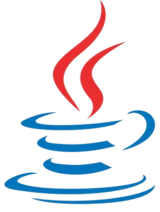
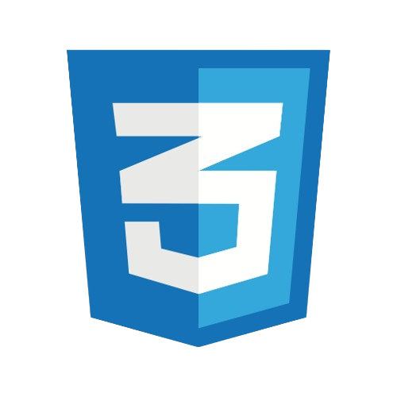
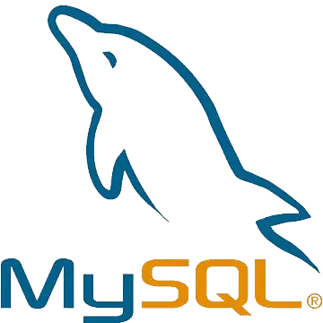
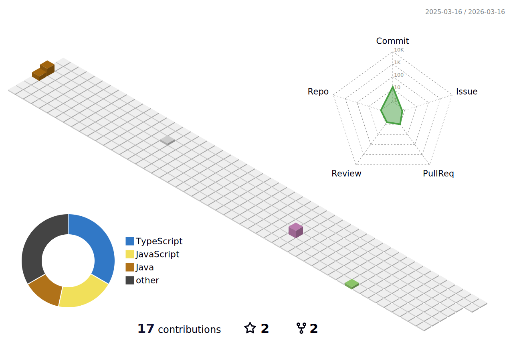

# Hola!👋 Mi nombre es Luciano 😃

**Desarrollador Full Stack** 💻

 

## Sobre mí
Comencé mi aventura en la programación en 2022 y me apasioné de inmediato. Actualmente, estoy estudiando en la institución Iset, donde estoy perfeccionando mis habilidades en Programación Orientada a Objetos con Java.

Me considero un buen compañero de equipo, siempre dispuesto a colaborar y enfrentar nuevos desafíos. ¡Gracias por tomarte el tiempo de leer mi perfil! 🌟

## Contacto
&emsp;
&emsp;

## ⚡ Tecnologías

### 🚀 Lenguajes

  &emsp;
  &emsp;
  &emsp;
  &emsp;
  &emsp;
  &emsp;
  &emsp;
  &emsp;

### 🧩 Frameworks

  &emsp;
  &emsp;
  &emsp;

### 🔤 Idiomas

  - &ensp;Ingles B2

  - &ensp;Español Nativo

## 📝 Trabajando en...

