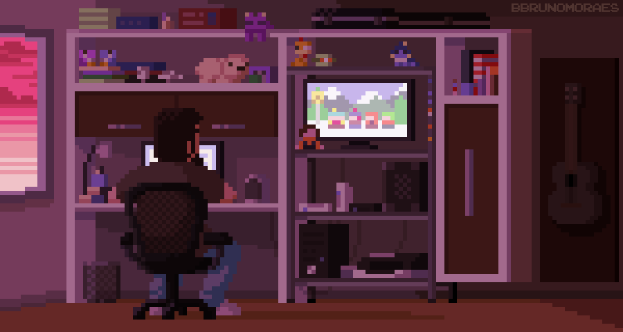
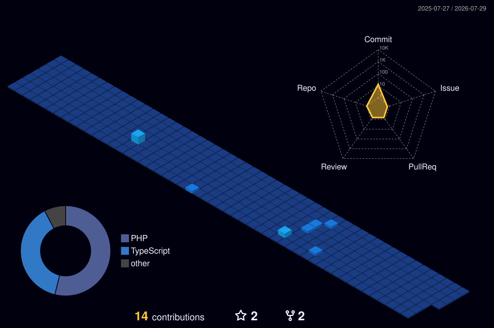

Hola, soy Luciano González 👋

Backend Developer | PHP & Laravel

APIs REST · MySQL · Integraciones de pago · Sistemas de gestión educativa

  
  
  

📍 Mar del Plata, Argentina · 🌐 Inglés B2

Sobre mí

Soy desarrollador backend especializado en PHP, Laravel y MySQL. Trabajo construyendo y manteniendo APIs, lógica de negocio y procesos que forman parte de sistemas reales de gestión.

Comencé a programar en 2022 y desde entonces mantengo una mentalidad de aprendizaje constante. Me considero una persona adaptable, resolutiva y comprometida con entregar soluciones estables.

Experiencia práctica

Actualmente participo en el desarrollo y mantenimiento de una plataforma de gestión educativa, trabajando sobre módulos académicos, administrativos y financieros.

Algunas de las tareas en las que tengo experiencia:

✓ Diseño y mantenimiento de endpoints REST
✓ Reglas de negocio y validaciones complejas
✓ Integraciones de pagos y servicios externos
✓ Procesos multiinstitución y bases de datos MySQL
✓ Automatizaciones, sincronizaciones y tareas programadas
✓ Análisis y corrección de errores en producción
✓ Colaboración entre backend Laravel y frontend Angular

Tecnologías

Backend y bases de datos

  
  
  
  
  

Frontend

  
  
  
  
  
  
  

Otros lenguajes y herramientas

  
  
  
  
  
  
  

Actualmente trabajando en

Un nuevo portfolio profesional enfocado en mi perfil Backend PHP/Laravel.

Nuevos proyectos backend con documentación, pruebas y despliegue.

Docker y buenas prácticas de infraestructura para entornos reproducibles.

Profundización en arquitectura, seguridad y rendimiento de APIs.

Actividad

  

 
¿Hablamos?
 

Estoy interesado en seguir creciendo como Backend Developer PHP/Laravel y participar en proyectos donde pueda aportar experiencia práctica, responsabilidad y ganas de aprender.

