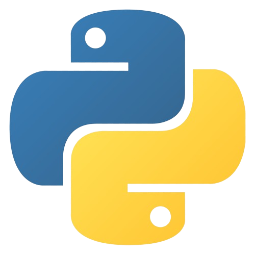
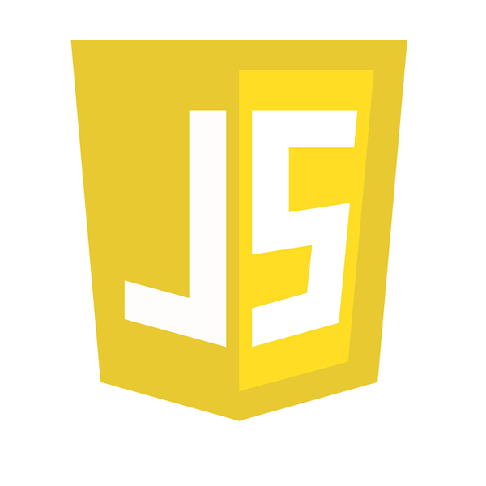

# Hola!👋 Mi nombre es Luciano 😃

**Desarrollador Full Stack** 💻

 

## Sobre mí
- Trabajo en equipo

- Soy creativo
  
- Pasión por la programación
  
- Ingles B2

- Aprendo constantemente

## Contacto
 
 

## ⚡ Tecnologías

### 🚀 Lenguajes

  &emsp;
  &emsp;
  &emsp;
  &emsp;
  &emsp;
  &emsp;
  &emsp;

<!--
**Gonzalez-Luciano/Gonzalez-Luciano** is a ✨ _special_ ✨ repository because its `README.md` (this file) appears on your GitHub profile.

Here are some ideas to get you started:

- 🔭 I’m currently working on ...
- 🌱 I’m currently learning ...
- 👯 I’m looking to collaborate on ...
- 🤔 I’m looking for help with ...
- 💬 Ask me about ...
- 📫 How to reach me: ...
- 😄 Pronouns: ...
- ⚡ Fun fact: ...
-->
